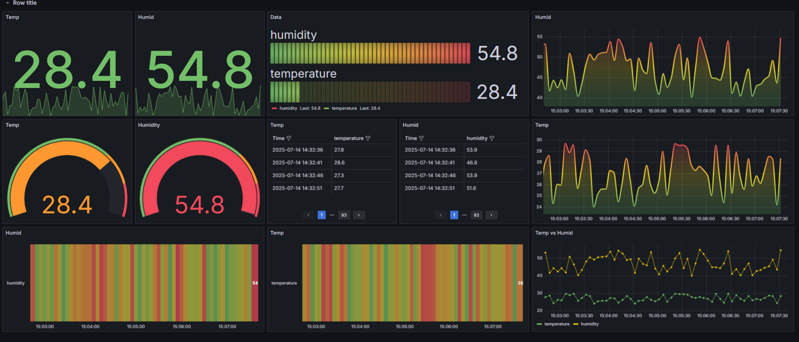
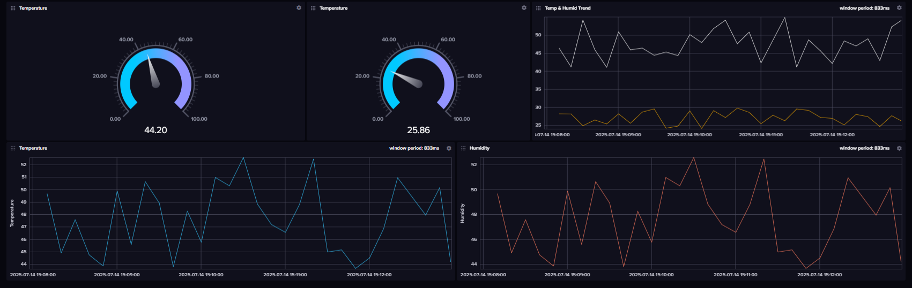
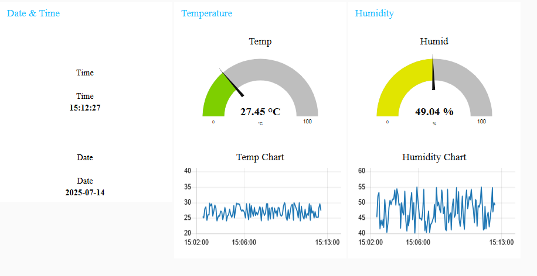
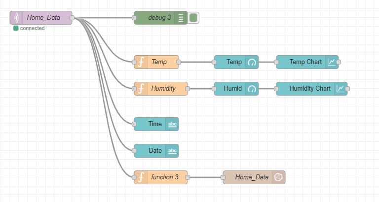

# 🏠 Real-Time Home Automation Dashboard using MQTT, Node-RED, InfluxDB & Grafana


---

## 📌 Project Overview

This project showcases a complete **Smart Home Automation System** built using **Node-RED**, **MQTT**, **InfluxDB**, and **Grafana** on a local machine (no ESP hardware required). It simulates sensor data like **temperature** and **humidity**, logs it into InfluxDB via Node-RED, and visualizes it in real-time on Grafana.

> 📍 Ideal for IoT Data Analysts and Home Automation enthusiasts who want to build and visualize sensor systems without needing actual hardware like ESP32 or Raspberry Pi.

---

## 💡 Tech Stack

* **Python (paho-mqtt)** – Sensor simulation via MQTT
* **Mosquitto Broker** – Local MQTT message handling
* **Node-RED** – Data ingestion & InfluxDB pipeline
* **InfluxDB** – Time-series database
* **Grafana** – Dashboard visualizations

---

## 🧭 System Architecture

```
Python MQTT Publisher → Mosquitto Broker → Node-RED → InfluxDB → Grafana Dashboard
```

---

## ✅ Key Features

* Simulates sensor data every 5s (temperature, humidity, timestamp)
* Node-RED parses and stores MQTT data into InfluxDB
* Grafana visualizes InfluxDB time-series data via line charts
* Optional alerts (via Grafana or Node-RED) on thresholds
* Modular design — easy to switch from simulation to ESP32

---

## 🔌 MQTT Data Format

Example MQTT message (Topic: `home/room1/sensors`):

```json
{
  "temperature": "28.56 °C",
  "humidity": "44.21 %",
  "date": "2025-07-14",
  "time": "20:12:35"
}
```

---

## 📊 Grafana Dashboard

| Panel       | Description                         |
| ----------- | ----------------------------------- |
| Temperature | Line chart of temperature over time |
| Humidity    | Line chart of humidity over time    |
| Data Table  | Tabular view of InfluxDB readings   |

---

## 📁 Project Structure

```
home_automation_dashboard/
│
├── mqtt_simulator.py        
├── node_red_flows.json      
├── grafana_dashboard.json   
├── screenshots/             
│   ├── node_red_flow.png
│   ├── influxdb_bucket.png
│   └── grafana_charts.png
├── README.md
└── LICENSE
```

---

## ⚙️ Setup Instructions

### 1. Install Required Tools

Install the following tools:

```bash
# Install Mosquitto (MQTT Broker)
sudo apt install mosquitto mosquitto-clients

# Install Node-RED
npm install -g --unsafe-perm node-red

# Install InfluxDB (v2.x OSS)
brew install influxdb  # OR see official docs for your OS

# Install Grafana
brew install grafana   # OR download from grafana.com
```

### 2. Start Services

```bash
# Start Mosquitto
mosquitto

# Start Node-RED
node-red

# Start InfluxDB
influxd

# Start Grafana (on localhost:3000)
grafana-server
```

### 3. Run Sensor Data Simulator

```bash
python mqtt_simulator.py
```

---

## 📥 Node-RED Flow Setup

1. Import `node_red_flows.json` into Node-RED.
2. Ensure MQTT input matches topic `home/room1/sensors`
3. Configure InfluxDB node with:

   * Bucket name: `home_data`
   * Auth token & org (InfluxDB v2)
4. Deploy the flow and verify payloads.

---

## 📊 Grafana Dashboard Setup

1. Open Grafana at `http://localhost:3000`
2. Add InfluxDB as a data source (InfluxQL or Flux)
3. Create panels for temperature/humidity
4. (Optional) Import pre-built dashboard: `grafana_dashboard.json`

---

## 🔒 Security Notes

* No authentication is enabled in Mosquitto/InfluxDB by default
* You can enable InfluxDB authentication for token-based access
* Grafana supports user roles, passwords, and dashboard sharing

---

## 🧩 Visuals

<h3>📉 Grafana Dashboard</h3>


<h3>🧾 InfluxDB Dasboard</h3>


<h3>🧾 Node-Red Dasboard</h3>


<h3>🧩 Node-RED Flow</h3>


---

## 🚀 Future Improvements

* Add control system for appliances (simulate fan/AC)
* Add sensors like PIR, gas, light using ESP32 later
* Enable Grafana alerting via Telegram, Email, etc.
* Host system on Raspberry Pi or Digital Ocean
* Enable public dashboard access via secure tunnel

---

## 🧠 Learning Outcomes

* End-to-end IoT data pipeline (MQTT → DB → Visualization)
* Real-time data ingestion and visualization tools
* Modular code for transition from simulation to hardware
* Production-grade dashboard building experience

---

## 🤝 Contact & Contribution

Feel free to fork this repo, open issues, or submit improvements.
Reach me on [LinkedIn](https://www.linkedin.com/in/dhananjaykharkar/)

---

⭐ **If you like this project, please give it a star!**
📄 Licensed under the [MIT License](LICENSE)

---
